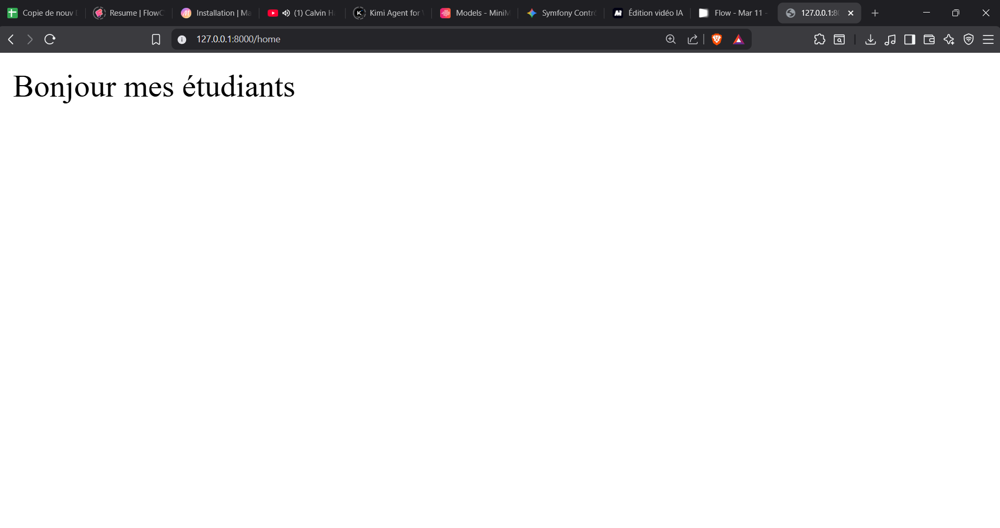
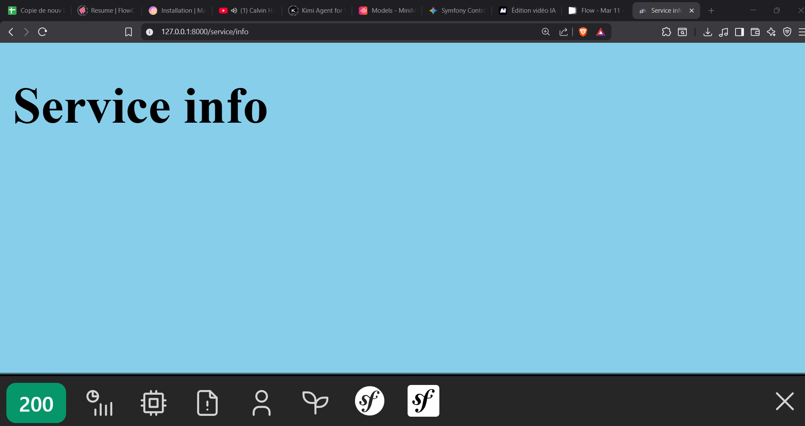

# Atelier Symfony : Contrôleur et Routing 🚀

## 📖 Description du Projet
Ce projet est une application Symfony éducative créée dans le cadre d'un atelier pratique (TP). L'objectif principal est d'apprendre à manipuler les **Contrôleurs**, le système de **Routing**, et l'intégration des vues avec **Twig**.

## ✨ Fonctionnalités implémentées
- **Création de Contrôleurs :** Génération manuelle et via la console Symfony (`make:controller`).
- **Routage de base :** Définition de routes statiques en utilisant les attributs PHP 8 (`#[Route]`).
- **Routage dynamique :** Passage de paramètres dans l'URL (ex: `/service/{name}`).
- **Redirection :** Redirection d'une route vers une autre au sein d'un contrôleur (`redirectToRoute`).
- **Templates Twig :** Affichage dynamique de variables envoyées par le contrôleur vers la vue HTML.

## 🗂️ Structure des fichiers clés
- `src/Controller/HomeController.php` : Contrôleur gérant la page d'accueil (`/home`).
- `src/Controller/ServiceController.php` : Contrôleur gérant les services et la redirection (`/service/{name}`, `/gotoindex`).
- `templates/services/showService.html.twig` : Template affichant les données dynamiques du service.

## � Captures d'écran




## �🚀 Installation et Démarrage

### Prérequis
- PHP 8.x
- [Composer](https://getcomposer.org/)
- [Symfony CLI](https://symfony.com/download)

### Démarrer le projet
1. Clonez ou téléchargez le projet.
2. Installez les dépendances via Composer (si nécessaire) :
   ```bash
   composer install
   ```
3. Lancez le serveur local de Symfony :
   ```bash
   symfony server:start
   ```
4. Accédez au projet via votre navigateur à l'adresse indiquée (généralement `http://127.0.0.1:8000`).

## 🧪 URLs à tester
Une fois le serveur démarré, vous pouvez tester les routes suivantes dans votre navigateur :

| Route | URL de test (exemple) | Description |
|-------|-----------------------|-------------|
| `/home` | `http://127.0.0.1:8000/home` | Affiche un simple message "Bonjour mes étudiants". |
| `/service/{name}` | `http://127.0.0.1:8000/service/informatique` | Affiche dynamiquement le nom passé en paramètre via Twig. |
| `/gotoindex` | `http://127.0.0.1:8000/gotoindex` | Redirige automatiquement l'utilisateur vers la route `/home`. |

## 🛠️ Dépannage (Troubleshooting)
En cas d'erreur `404 Not Found` :
- **Vérifiez l'URL :** Assurez-vous d'utiliser l'URL au singulier avec un paramètre (ex: `/service/mot`) et non pas `/services` sans rien derrière.
- **Videz le cache Symfony :**
  ```bash
  php bin/console cache:clear
  ```
- **Vérifiez que vos routes sont bien détectées :**
  ```bash
  php bin/console debug:router
  ```

---
*Projet réalisé dans le cadre de l'année universitaire 2025-2026 - Auditoire GINFO1*
